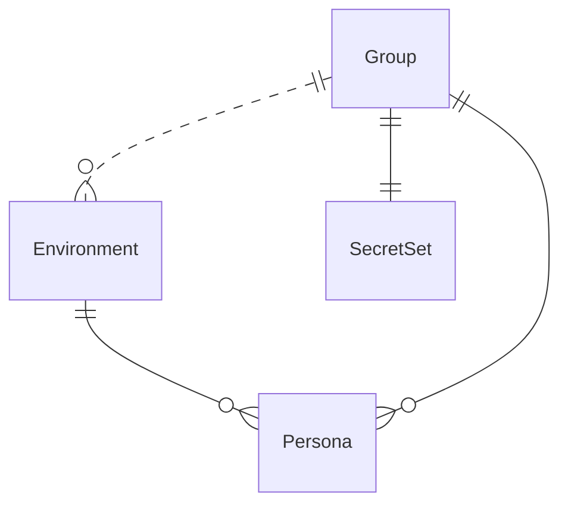

{/* Generated by `modelith render`. Do not edit by hand; edit the .modelith.yaml source and re-render. */}

# tell-me-go — Environment Management

Models the shell-based environment management system that provisions, configures, and switches between isolated `tell-me-go` sessions. Covers the full evolution from bash aliases through Toby, Dobby, Porter, Sprawl, Winky, Flopsy, and Niffler.

## Glossary

- **`History`** — Cross-context: the persisted conversation record from the `tell-me-go` domain model. Lives under `TELL_ME_HOME/output/<mode>/`.
- **`HotSwap`** — Changing the active LLM provider within an `Environment` without losing session `History`, `Task`s, or `SafePath`s. Possible because the provider is never encoded in the `Environment` directory name (Dobby onwards).
- **`MODE`** — A YAML config key identifying the `Persona` (e.g. 'butler', 'architect', 'coder').
- **`PERSON`** — A YAML config key containing the system prompt for a `Persona`.
- **`Provision`** — The act of creating a new `Environment` from a `Group` template: copying configs and secrets, generating full role configs from `Persona` stubs, and optionally copying `docs/skills/`.
- **`RemoteHost`** — An SSH-reachable machine where an `Environment` can be deployed for remote sub-agent execution (Sprawl) or interactive use (Winky).
- **`SafePath`** — Cross-context: an authorized directory boundary from the `tell-me-go` domain model. Persisted in the session state database.
- **`Tag`** — The human-chosen name portion of an `Environment` directory (`ait-<tag>`). Identifies a project or workspace. The tag is fixed at provisioning time and never changes — only the active provider switches.
- **`Task`** — Cross-context: a user-facing to-do item from the `tell-me-go` domain model. Persisted in the session state database.

## Enums

### `ProvisionFlag`

Flags that modify `Provision` behaviour. Mutually independent — any combination is valid.

| Value | Definition |
| --- | --- |
| `priority` | Use the priority-tier `butler-priority.yaml` as the merge source, with Vertex AI shared/priority headers. |
| `clean` | Skip copying the `docs/` directory from the `Group` template. |

## Entities

### `Environment`

A self-contained `ait-<tag>/` directory provisioned from exactly one `Group`. The `Tag` forms the directory name and is fixed at provisioning time — only the active provider changes. Contains generated configs, secrets, optional skills, and an `output/` directory for session state. The provider is never encoded in the directory name (Dobby onwards), enabling mid-session `HotSwap`. Managed by shell scripts (Dobby, Niffler); used by `tell-me-go` as `TELL_ME_HOME`. May be deployed to a `RemoteHost` for remote execution (Sprawl) or interactive use (Winky).

**Relationships**

- `Persona` — 1:n — owned — Generated full configs from the `Group`'s `Persona` stubs. Distinct lifecycle stage from the stub — the stub is owned by the `Group`, the generated config by the `Environment`.

**Attributes**

| Name | Type | Description |
| --- | --- | --- |
| `tag` | string | The human-chosen name (e.g. 'tmg', 'myproject'). Forms the directory name `ait-<Tag>`. |
| `activeProvider` | string | The currently sourced LLM provider. Can be changed via `HotSwap` without affecting the `Environment`. |
| `provisionFlags` | ProvisionFlag | Zero or more flags applied at `Provision` time (e.g. `priority`, `clean`). Flags are mutually independent — any combination is valid. |
| `personaAliases` | map[string]string | _Derived:_ Map of single-letter shell aliases (e.g. 'a' → 'architect') to `Persona` names, derived from the first letter of each `Persona` filename. |

**Actions**

- `provision` — Create an `Environment` from a `Group`: copy configs, secrets, generate persona configs, optionally copy `docs/skills/`.
- `hotswap` — Switch the active provider without changing the `Environment` directory — `History`, `Task`s, and `SafePath`s are preserved.

**Invariants**

- **env-provider-not-in-path** — The provider is never encoded in the `Environment` directory name — the directory is `ait-<tag>`, not `ait-<tag>-<provider>`.
- **env-hotswap-preserves-state** — `HotSwap`ping the provider must not affect `History`, `Task`s, or `SafePath`s.

### `Group`

A self-contained category template under `ait-base/<group>/` that defines a set of `Persona` stubs, a `SecretSet`, and optional `docs/skills/`. `Group`s are the template layer — they are never used directly by `tell-me-go`. An `Environment` is provisioned from exactly one `Group`, and the `Group`'s identity is never referenced after provisioning.

**Relationships**

- `Environment` — 1:n — referenced — `Environment`s provisioned from this `Group`.
- `Persona` — 1:n — owned — `Persona` stubs discovered from this `Group`'s `configs/` directory.
- `SecretSet` — 1:1 — owned — API keys and credentials bundled with this `Group` template.

**Attributes**

| Name | Type | Description |
| --- | --- | --- |
| `name` | string | Directory name under `ait-base/` (e.g. "engineers", "actors"). |
| `hasSkills` | boolean | _Derived:_ True when the `Group` template contains a `docs/skills/` directory. |

**Invariants**

- **group-has-butler** — Every `Group` must contain a `configs/butler.yaml` master config file.

### `Persona`

A role definition consisting of a `MODE` and `PERSON` (system prompt). Stored as a lightweight YAML stub in a `Group`'s `configs/` directory. At `Provision` time, each `Persona` stub is merged with the `Group`'s `butler.yaml` to generate a full config file in the `Environment`. Shell aliases are derived from the first letter of the `Persona` filename.

**Attributes**

| Name | Type | Description |
| --- | --- | --- |
| `name` | string | Filename stem (e.g. 'architect', 'coder', 'alice'). Doubles as the `MODE` value. |
| `person` | string | The system prompt (`PERSON`) injected into the generated config. |
| `alias` | string | _Derived:_ First letter of `name` (e.g. 'a' for 'architect'). |

**Invariants**

- **persona-alias-unique** — No two `Persona`s within the same `Group` may share the same first letter.
- **persona-b-reserved** — The alias `b` is reserved for the butler `Persona` — no other `Persona` may have a name starting with `b`.

### `SecretSet`

A collection of API keys, service account credentials, and environment variables bundled with a `Group` template. Copied into each provisioned `Environment`. Never transmitted over SSH — remote `Environment`s source their own local copy.

**Attributes**

| Name | Type | Description |
| --- | --- | --- |
| `keyFile` | string | Path to the service account JSON credentials file. |
| `envFile` | string | Path to the shell file exporting API key environment variables. |

**Invariants**

- **secrets-per-group** — Each `Group` template carries its own `secrets/` directory — secrets are never shared between `Group`s.

## Relationships

## Invariants

- **group-provider-choice** — The `Group` template includes ALL supported providers in `butler.yaml`. The active provider is chosen at source time or via `HotSwap` — it is never baked into the `Group` template or `Environment` directory name.

## Scenarios

### Provision a new environment from a group

A user creates a new `Environment` from a `Group` template using the Niffler shell script. The `Group`'s `Persona` stubs are discovered, validated, and merged with `butler.yaml` to generate full role configs. Secrets and optional skills are copied.

**Actors:** Group, Environment, Persona, SecretSet

**Steps**

1. User runs `source niffler.sh -n engineers tmg vertex-flash`.
2. Niffler scans `ait-base/engineers/configs/` and discovers four `Persona` stubs: architect, coder, reviewer, tester.
3. Each `Persona`'s first letter is checked: no duplicates, and `b` is not claimed.
4. For each `Persona`, the stub (`MODE` + `PERSON`) is merged with `butler.yaml` into a full `<persona>.yaml` config.
5. `SecretSet` is copied from the `Group` template to the `Environment`.
6. `docs/skills/` is copied (the `engineers` `Group` has Go skills).
7. Shell aliases (`b`, `a`, `c`, `t`, `r`) are defined from `Persona` first letters (butler is always pre-seeded).
8. The terminal prompt updates to `[tmg|vertex-flash]`.

**Invariants touched**

- **group-has-butler** — Every `Group` must contain a `configs/butler.yaml` master config file.
- **persona-alias-unique** — No two `Persona`s within the same `Group` may share the same first letter.
- **persona-b-reserved** — The alias `b` is reserved for the butler `Persona` — no other `Persona` may have a name starting with `b`.
- **env-provider-not-in-path** — The provider is never encoded in the `Environment` directory name — the directory is `ait-<tag>`, not `ait-<tag>-<provider>`.
- **secrets-per-group** — Each `Group` template carries its own `secrets/` directory — secrets are never shared between `Group`s.

### Mid-session provider hot-swap

The user switches the active LLM provider without changing the `Environment`. All session state — `History`, `Task`s, and `SafePath`s — is preserved because the provider is not encoded in the directory name. The same prompt can be re-sent to compare models.

**Actors:** Environment, Persona

**Steps**

1. User has an active `Environment` `ait-tmg/` sourced with `vertex-flash`.
2. Mid-session, user runs `source niffler.sh deepseek-pro`.
3. The re-entry guard detects the environment is already sourced — it strips the old prompt prefix and re-applies with the new provider.
4. Shell aliases (`b`, `a`, `c`, `t`, `r`) are re-defined with `deepseek-pro` as the provider.
5. The terminal prompt updates to `[tmg|deepseek-pro]`.
6. All `Persona` configs remain unchanged — only the `activeProvider` changes.
7. The user can now send the same prompt to compare model outputs.

**Invariants touched**

- **env-provider-not-in-path** — The provider is never encoded in the `Environment` directory name — the directory is `ait-<tag>`, not `ait-<tag>-<provider>`.
- **env-hotswap-preserves-state** — `HotSwap`ping the provider must not affect `History`, `Task`s, or `SafePath`s.

### Persona alias collision detection

When provisioning an `Environment`, Niffler validates that no two `Persona` stubs in the `Group` share the same first letter, and that no `Persona` claims the reserved `b` alias. Violations abort provisioning and clean up the partial workspace.

**Actors:** Group, Persona, Environment

**Steps**

1. A `Group` template contains `alice.yaml` and `architect.yaml` — both start with `a`.
2. User attempts to provision an `Environment` from this `Group`.
3. During `Persona` discovery, Niffler detects the alias collision.
4. Provisioning is aborted with an error message naming the conflicting files.
5. The partial `Environment` directory is cleaned up.

**Invariants touched**

- **persona-alias-unique** — No two `Persona`s within the same `Group` may share the same first letter.
- **persona-b-reserved** — The alias `b` is reserved for the butler `Persona` — no other `Persona` may have a name starting with `b`.

