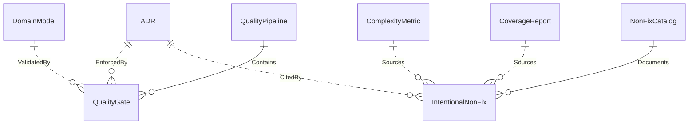

{/* Generated by `modelith render`. Do not edit by hand; edit the .modelith.yaml source and re-render. */}

# tell-me-go — Code Quality Maintenance Process

Models how tell-me-go maintains code quality before public release: the ordered QualityPipeline of gates executed by `make check` and `make check-full`, and the triage loop that turns coverage gaps and complexity alerts into documented IntentionalNonFix entries in the NonFixCatalog.

## Glossary

- **`Agent`** — An AI assistant working in the repository that must consult the `NonFixCatalog` before flagging issues and must not add or remove catalog entries unilaterally.
- **`Architect`** — The maintainer who curates the `NonFixCatalog` and `ADR`s: classifies gaps, records `IntentionalNonFix` entries, and accepts or rejects design changes. Only the architect records catalog entries.
- **`Operator`** — The human or AI maintainer who runs the `QualityPipeline`, inspects `CoverageReport`s and `ComplexityMetric`s, and executes the triage loop.

## Enums

### `AcceptanceClass`

The triage classification of an `IntentionalNonFix` entry, used by the architect to justify why an issue is deliberately left unaddressed.

| Value | Definition |
| --- | --- |
| `structurally-unreachable` | The error branch cannot fire in correct code — e.g. json.Marshal on an all-string struct, or StdoutPipe before Start. |
| `delegation-wrapper` | A thin pass-through that would only re-test the underlying implementation — e.g. domainFS.Chmod, AppendTask, RealClock. |
| `platform-specific` | A branch only executable on a specific OS — e.g. Windows path separators, Darwin kernel observation. |
| `fault-injection-required` | Triggering the branch requires filesystem or driver fault injection disproportionate to the test value. |
| `defensive-guard` | A nil or empty guard on internal pipeline state that callers never produce. |
| `interface-stub` | A no-op method that exists solely to satisfy an interface contract — e.g. auth.Invalidate, NoOpEventBus. |
| `test-complexity` | Sequential state-mutation or dispatch-heavy test where splitting would duplicate expensive setup. |
| `dispatch-structural` | Cyclomatic complexity from type-switch or branch count, not branching business logic — e.g. handleDomainEvent (CC=12). |
| `soft-enforcement` | An invariant deliberately enforced as a warning rather than a hard failure — e.g. skill-unique-name. |

### `GateKind`

The category of a `QualityGate`, mirroring the sections of the Makefile.

| Value | Definition |
| --- | --- |
| `build` | Compilation and formatting gates — fmt, tidy, build. |
| `lint` | Static analysis via golangci-lint. |
| `verify` | Convention guards that fail on any violation — verify-architecture, verify-mock-pattern, verify-no-test-sleep, verify-adr-index, verify-no-testing-import, verify-session-provider-mock. |
| `modelith` | Domain-model gates — modelith-lint, modelith-render, modelith-check, and the advisory drift gates (modelith-drift, modelith-layers, modelith-vocab). |
| `test` | Test execution gates — test, test-race, fuzz-smoke, test-coverage. |
| `security` | Dependency vulnerability scanning — vulncheck. |
| `analysis` | Dead-code analysis — the dead-code gate. |

### `NonFixStatus`

The lifecycle status of an `IntentionalNonFix` entry in the `NonFixCatalog`.

| Value | Definition |
| --- | --- |
| `accepted` | The issue is deliberately left as-is with a documented rationale. |
| `resolved` | The issue was later fixed and the entry is kept as a record. |
| `rejected` | The architect rejected the proposed change — e.g. design rejections like the MockEstimator collapse. |
| `done` | The follow-up work was completed — e.g. the ADR-021 follow-ups. |
| `superseded` | The entry was replaced by a newer entry — e.g. RecoveryStep CC=9 superseded by CC=12. |

## Entities

### `ADR`

An Architecture Decision Record — a numbered, indexed document under docs/adr/ capturing an architectural decision and its rationale. Every ADR file must appear in docs/adr/README.md and ADR numbers must be unique. ADRs govern conventions enforced by `QualityGate`s (ADR-021 test doubles, ADR-022 testing imports, ADR-036 determinism, ADR-053 cost metrics).

**Relationships**

- `QualityGate` — 1:n — referenced — EnforcedBy — `QualityGate`s that enforce this `ADR`.
- `IntentionalNonFix` — 1:n — referenced — CitedBy — `IntentionalNonFix` entries that cite this `ADR`.

**Attributes**

| Name | Type | Description |
| --- | --- | --- |
| `number` | integer | The unique ADR number (e.g. 53 for ADR-053). |
| `path` | string | The file under docs/adr/, e.g. 2026-08-remove-get-cost-summary-and-daily-cost-metric.md. |
| `title` | string | The decision title, e.g. "removal of the get_cost_summary tool". |

**Actions**

- `index` — actor `Architect`; preserves adr-index-consistent — Add the ADR file to docs/adr/README.md so the index stays consistent.

**Invariants**

- **adr-index-consistent** — Every `ADR` under docs/adr/ is listed in docs/adr/README.md, and no ADR number is claimed by more than one file.

### `ComplexityMetric`

The cyclomatic complexity score per function produced by the complexity tooling. Drives the triage loop: functions at or above the policy threshold are reviewed and either refactored or accepted as `IntentionalNonFix` entries. The repo policy treats CC below 10 as acceptable; higher scores require a documented rationale.

**Relationships**

- `IntentionalNonFix` — 1:n — referenced — Sources — Complexity alerts accepted as `IntentionalNonFix` entries.

**Attributes**

| Name | Type | Description |
| --- | --- | --- |
| `function` | string | The fully qualified function name being measured. |
| `score` | integer | The cyclomatic complexity value. |
| `threshold` | integer | The policy threshold — scores of 10 or below are acceptable without rationale. |

**Invariants**

- **complexity-threshold-policy** — A function with CC of 10 or below is acceptable by policy; CC above 10 (11 or more) requires either a refactor or a documented `IntentionalNonFix` entry.

### `CoverageReport`

The coverage measurement produced by `make test-coverage`: a per-package profile from `go test -coverprofile`, with test-double directories (agenttest/, orchestratortest/, configtest/, analysistest/, clitest/, eventstest/, persistencetest/, toolstest/, internal/infrastructure/testing/) explicitly excluded. Drives the triage loop — each identified gap is either fixed, accepted as an `IntentionalNonFix`, or rejected as out of scope.

**Relationships**

- `IntentionalNonFix` — 1:n — referenced — Sources — Gaps identified in this report that were accepted as `IntentionalNonFix` entries.

**Attributes**

| Name | Type | Description |
| --- | --- | --- |
| `generatedAt` | timestamp | When `make test-coverage` produced this report. |
| `excludedPaths` | []string | The documented test-double directories filtered out of the metrics. |

**Invariants**

- **coverage-exclusions-explicit** — The `CoverageReport` excludes exactly the documented test-double directories (agenttest/, orchestratortest/, configtest/, analysistest/, clitest/, eventstest/, persistencetest/, toolstest/, internal/infrastructure/testing/); new test helpers must be added to the exclusion list, never silently included or omitted.

### `DomainModel`

The canonical domain-model artifact for tell-me-go — docs/domain-model/tell-me-go.modelith.yaml plus its rendered Markdown. The rendered `.md` is generated by modelith and never hand-edited; modelith-check fails CI if the committed `.md` is stale. The modelith gates lint, render, and drift-check this artifact.

**Relationships**

- `QualityGate` — 1:n — referenced — ValidatedBy — The modelith gates (modelith-lint, modelith-render, modelith-check, modelith-drift, modelith-layers, modelith-vocab) that operate on this artifact.

**Attributes**

| Name | Type | Description |
| --- | --- | --- |
| `yamlPath` | string | docs/domain-model/tell-me-go.modelith.yaml — the canonical source. |
| `mdPath` | string | The generated Markdown rendered from the `.yaml`; never hand-edited. |

**Actions**

- `render` — actor `Operator`; preserves domainmodel-md-generated — Regenerate the `.md` from the `.yaml` via `modelith render`.

**Invariants**

- **domainmodel-md-generated** — The rendered `.md` is generated from the `.yaml` by modelith and never hand-edited; `modelith-check` fails if the committed `.md` is stale.

### `IntentionalNonFix`

A documented decision to leave a known issue unaddressed, with rationale and references to code locations. Carries a status and an acceptance class, and may cite an `ADR`. Entries are recorded by the architect — never added unilaterally by an agent — and are the canonical answer to "why is this not fixed?".

**Attributes**

| Name | Type | Description |
| --- | --- | --- |
| `status` | NonFixStatus | The lifecycle status — accepted, resolved, rejected, done, or superseded. |
| `acceptanceClass` | AcceptanceClass | The triage classification justifying the decision. |
| `rationale` | string | Why the issue is deliberately left unaddressed. |
| `references` | []string | Code locations (file paths, commits, line numbers) and `ADR` citations. |
| `recordedAt` | timestamp | When the entry was recorded by the `Architect`. |

**Invariants**

- **nonfix-has-acceptance-class** — Every `IntentionalNonFix` entry carries an acceptance class and a rationale; an entry without both is invalid.
- **nonfix-references-code** — Every `IntentionalNonFix` entry references the code locations it documents — file paths, and commit or line numbers where relevant.

### `NonFixCatalog`

The authoritative catalog of accepted `IntentionalNonFix` entries — coverage gaps, structural concerns, complexity alerts, and design rejections — at docs/architect/INTENTIONAL_NON_FIXES.md. Curated by the architect; AI agents must consult it before flagging already-settled issues. Owns its entries.

**Relationships**

- `IntentionalNonFix` — 1:n — owned — Documents — The cataloged entries, each with status, rationale, and acceptance class.

**Attributes**

| Name | Type | Description |
| --- | --- | --- |
| `path` | string | docs/architect/INTENTIONAL_NON_FIXES.md |
| `entryCount` | integer | _Derived:_ Number of `IntentionalNonFix` entries in the catalog. |

**Actions**

- `record-entry` — actor `Architect`; preserves catalog-architect-curated, nonfix-has-acceptance-class — Add a new `IntentionalNonFix` entry with status, class, rationale, and references.

**Invariants**

- **catalog-authoritative** — The `NonFixCatalog` is the authoritative answer to why a known issue is unaddressed; it must be consulted before an issue is re-flagged.
- **catalog-architect-curated** — Only the `Architect` records or removes `IntentionalNonFix` entries; an `Agent` never edits the catalog unilaterally.

### `QualityGate`

A single check in the `QualityPipeline`, backed by a Makefile target. Examples include fmt, tidy, build, lint, verify-architecture, verify-mock-pattern, verify-no-test-sleep, verify-adr-index, modelith-check, fuzz-smoke, vulncheck, test, and test-race. A failing gate fails the pipeline; some gates are zero-tolerance (any violation fails), while the modelith drift gates are advisory only.

**Attributes**

| Name | Type | Description |
| --- | --- | --- |
| `name` | string | The Makefile target name, e.g. verify-mock-pattern. |
| `kind` | GateKind | The gate category — build, lint, verify, modelith, test, security, or analysis. |
| `zeroTolerance` | boolean | True when any single violation fails the gate — verify gates per ADR-021/022/036. |
| `advisory` | boolean | True when the gate never fails the pipeline — modelith drift gates only. |

**Invariants**

- **zero-tolerance-gates-fail** — Zero-tolerance `QualityGate`s (verify-mock-pattern, verify-session-provider-mock, verify-no-test-sleep, verify-no-testing-import) fail on the first violation — there is no warning tier or baseline.
- **advisory-gates-never-block** — Advisory gates (modelith-drift, modelith-layers, modelith-vocab) never fail the `QualityPipeline`; they emit recommendations only.

### `QualityPipeline`

The ordered set of `QualityGate`s that code must pass before merge or public release. Executed as `make check` (fmt, tidy, build, lint, verify-*, modelith-check, fuzz-smoke, vulncheck, test, dead-code, test-coverage) or `make check-full`, which adds package-by-package race detection. Gates run in sequence; the pipeline stops at the first failing gate.

**Relationships**

- `QualityGate` — 1:n — owned — Contains — The gates executed in order — fmt, tidy, build, lint, verify-*, modelith-check, fuzz-smoke, vulncheck, test, dead-code, test-coverage, test-race.

**Attributes**

| Name | Type | Description |
| --- | --- | --- |
| `variant` | string | "check" (fast pipeline) or "check-full" (adds race detection). |
| `gateCount` | integer | _Derived:_ Number of `QualityGate`s in this pipeline. |

**Actions**

- `run-check` — actor `Operator`; preserves pipeline-stops-on-failure — Run the fast pipeline — `make check`.
- `run-check-full` — actor `Operator`; preserves full-pipeline-before-release, pipeline-stops-on-failure — Run the full pipeline including race detection — `make check-full`.

**Invariants**

- **pipeline-stops-on-failure** — `QualityGate`s run in sequence; the `QualityPipeline` stops at the first failing gate and reports it.
- **full-pipeline-before-release** — A public release requires the full pipeline — `make check-full` including race detection — to pass; `make check` alone is not sufficient.

## Relationships

## Invariants

- **triage-loop-closed** — Every gap in a `CoverageReport` or alert in a `ComplexityMetric` is either fixed, accepted as an `IntentionalNonFix` with a class and rationale, or explicitly rejected — none are silently dropped.

## Scenarios

### Full release gate run

An `Operator` runs `make check-full` before a public release. Every `QualityGate` passes in sequence — including the zero-tolerance verifications and the `DomainModel` drift check — and the release is green-lit.

**Actors:** Operator, QualityPipeline, QualityGate, DomainModel

**Steps**

1. `Operator` runs `make check-full` on the release branch.
2. fmt, tidy, and build pass; the binary compiles with the release version.
3. lint passes with no findings.
4. verify-architecture passes; domain entities are confirmed in internal/domain/.
5. verify-mock-pattern, verify-session-provider-mock, verify-no-test-sleep, and verify-adr-index pass — zero violations.
6. modelith-check passes — the committed `DomainModel` Markdown is not stale.
7. fuzz-smoke compiles all fuzz targets; vulncheck reports no known CVEs.
8. test passes; dead-code reports no zero-reference exports.
9. test-coverage runs and test-race passes package-by-package.
10. The pipeline completes with "All checks passed (including race detection)" and the release proceeds.

**Invariants touched**

- **full-pipeline-before-release** — A public release requires the full pipeline — `make check-full` including race detection — to pass; `make check` alone is not sufficient.
- **pipeline-stops-on-failure** — `QualityGate`s run in sequence; the `QualityPipeline` stops at the first failing gate and reports it.
- **zero-tolerance-gates-fail** — Zero-tolerance `QualityGate`s (verify-mock-pattern, verify-session-provider-mock, verify-no-test-sleep, verify-no-testing-import) fail on the first violation — there is no warning tier or baseline.
- **advisory-gates-never-block** — Advisory gates (modelith-drift, modelith-layers, modelith-vocab) never fail the `QualityPipeline`; they emit recommendations only.
- **domainmodel-md-generated** — The rendered `.md` is generated from the `.yaml` by modelith and never hand-edited; `modelith-check` fails if the committed `.md` is stale.
- **adr-index-consistent** — Every `ADR` under docs/adr/ is listed in docs/adr/README.md, and no ADR number is claimed by more than one file.

### Gate failure blocks the pipeline

verify-mock-pattern fails on a new testify/mock import. The `QualityPipeline` stops at the failing gate — later gates never run — the violation is fixed, and the re-run passes.

**Actors:** Operator, QualityPipeline, QualityGate

**Steps**

1. A contributor adds a testify/mock import to a test double in a `*test/` package.
2. `Operator` runs `make check`; verify-mock-pattern fails with zero tolerance (ADR-021).
3. The `QualityPipeline` stops at the failing gate — test, dead-code, and coverage gates never run.
4. The import is converted to a hand-rolled function-field mock.
5. `Operator` re-runs `make check`; the gate passes and the pipeline continues.

**Invariants touched**

- **zero-tolerance-gates-fail** — Zero-tolerance `QualityGate`s (verify-mock-pattern, verify-session-provider-mock, verify-no-test-sleep, verify-no-testing-import) fail on the first violation — there is no warning tier or baseline.
- **pipeline-stops-on-failure** — `QualityGate`s run in sequence; the `QualityPipeline` stops at the first failing gate and reports it.

### Coverage gap triaged into the catalog

`make test-coverage` reveals a 0%-coverage gap in a delegation wrapper. The `Architect` classifies it, records an `IntentionalNonFix` entry, and later agents consult the `NonFixCatalog` instead of re-flagging it.

**Actors:** Operator, Architect, CoverageReport, NonFixCatalog, IntentionalNonFix

**Steps**

1. `Operator` runs `make test-coverage`; the `CoverageReport` shows a 0% gap in a delegation wrapper (e.g. domainFS.Chmod).
2. The `Architect` confirms the class: pure delegation wrapper — testing it would test the wrapper, not behavior.
3. The `Architect` records an `IntentionalNonFix` entry with status ACCEPTED, an acceptance class, a rationale, and file references.
4. The entry is added to the `NonFixCatalog` under the Coverage Gaps section.
5. A later `Agent` finds the gap and consults the `NonFixCatalog`; it sees the settled decision and does not re-flag it.

**Invariants touched**

- **coverage-exclusions-explicit** — The `CoverageReport` excludes exactly the documented test-double directories (agenttest/, orchestratortest/, configtest/, analysistest/, clitest/, eventstest/, persistencetest/, toolstest/, internal/infrastructure/testing/); new test helpers must be added to the exclusion list, never silently included or omitted.
- **triage-loop-closed** — Every gap in a `CoverageReport` or alert in a `ComplexityMetric` is either fixed, accepted as an `IntentionalNonFix` with a class and rationale, or explicitly rejected — none are silently dropped.
- **nonfix-has-acceptance-class** — Every `IntentionalNonFix` entry carries an acceptance class and a rationale; an entry without both is invalid.
- **nonfix-references-code** — Every `IntentionalNonFix` entry references the code locations it documents — file paths, and commit or line numbers where relevant.
- **catalog-authoritative** — The `NonFixCatalog` is the authoritative answer to why a known issue is unaddressed; it must be consulted before an issue is re-flagged.

### Complexity alert accepted as structural

Complexity tooling reports CC=12 on a type-switch dispatch handler. The `Architect` verifies the complexity is structural — switch/branch count, not branching business logic — and accepts it with a documented rationale instead of refactoring.

**Actors:** Architect, ComplexityMetric, NonFixCatalog, IntentionalNonFix

**Steps**

1. Complexity tooling reports CC=12 on handleDomainEvent — a 10-case type-switch in the Bubble Tea Update handler.
2. The `Architect` reviews: each case is a one-line delegation; the CC is structural dispatch, not branching logic.
3. Per the threshold policy, the function is accepted rather than refactored.
4. An `IntentionalNonFix` entry is recorded under Complexity Alerts with the shared acceptance rationale.
5. The catalog entry is referenced in the complexity audit for future triage.

**Invariants touched**

- **complexity-threshold-policy** — A function with CC of 10 or below is acceptable by policy; CC above 10 (11 or more) requires either a refactor or a documented `IntentionalNonFix` entry.
- **nonfix-has-acceptance-class** — Every `IntentionalNonFix` entry carries an acceptance class and a rationale; an entry without both is invalid.
- **catalog-architect-curated** — Only the `Architect` records or removes `IntentionalNonFix` entries; an `Agent` never edits the catalog unilaterally.

### ADR recorded and indexed

A new `ADR` is written (e.g. ADR-053 removing the global cost ledger). verify-adr-index confirms the file is indexed and the number is unique; the `DomainModel` and related `IntentionalNonFix` entries are updated to cite it.

**Actors:** Architect, ADR, QualityGate, IntentionalNonFix, DomainModel

**Steps**

1. The `Architect` writes ADR-053 documenting the removal of get_cost_summary, the DailyCost metric, and the global cost ledger.
2. The ADR file is added under docs/adr/ and listed in docs/adr/README.md.
3. verify-adr-index passes: the file is indexed and no number is duplicated.
4. The `DomainModel`'s cost-audit narrative is reviewed against the `ADR` — per-turn cost remains, the global ledger is gone.
5. Related `IntentionalNonFix` entries cite the `ADR` in their references.

**Invariants touched**

- **adr-index-consistent** — Every `ADR` under docs/adr/ is listed in docs/adr/README.md, and no ADR number is claimed by more than one file.

### Domain model drift caught in CI

A YAML edit to the `DomainModel` leaves the committed Markdown stale. modelith-check fails CI, the `Operator` regenerates the Markdown, and the gate passes on the next run.

**Actors:** Operator, DomainModel, QualityGate

**Steps**

1. A change edits the domain-model `.yaml` without regenerating the Markdown.
2. modelith-check runs in CI and fails: the committed `.md` is stale.
3. The `QualityPipeline` stops at the modelith gate.
4. `Operator` runs `modelith render` to regenerate the `.md` from the `.yaml`.
5. The regenerated `.md` is committed alongside the `.yaml`; modelith-check passes.

**Invariants touched**

- **domainmodel-md-generated** — The rendered `.md` is generated from the `.yaml` by modelith and never hand-edited; `modelith-check` fails if the committed `.md` is stale.
- **pipeline-stops-on-failure** — `QualityGate`s run in sequence; the `QualityPipeline` stops at the first failing gate and reports it.

