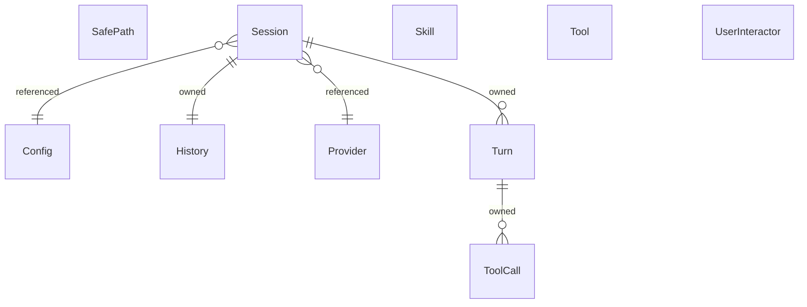

{/* Generated by `modelith render`. Do not edit by hand; edit the .modelith.yaml source and re-render. */}

# tell-me-go — Multi-Provider Reasoning Agent

A high-performance CLI assistant that unifies reasoning engines (Gemini, OpenAI, DeepSeek, Claude) under a single interface. Models the core conversation loop, provider abstraction, tool execution, security boundaries, and cost auditing.

## Glossary

- **`Orchestrator`** — The top-level loop that drives a `Session`: receives a user prompt, delegates to the active `Provider`, dispatches `Tool` calls, and manages the `Turn` lifecycle.
- **`SecurityManager`** — The component that validates `Tool` requests against the `SafePath` registry and delegates to the `UserInteractor` when user confirmation is required.
- **`Thought`** — A provider-agnostic reasoning block emitted by an LLM — may be a text response, a tool-call request, or (for reasoning models) a chain-of-thought segment. Normalised from provider-specific wire formats.
- **`Turn`** — One request–response cycle: a user message plus the assistant's full response (which may include multiple `Thought`s and tool round-trips).

## Enums

### `ProviderType`

The API family backing an LLM `Provider`.

| Value | Definition |
| --- | --- |
| `gemini` | Google Vertex AI (Gemini 3.0 / 3.1). |
| `openai` | OpenAI API (GPT-5.4 / 5.5). |
| `deepseek` | DeepSeek API (V3.2 / V4) or Vertex AI Model-as-a-Service. |
| `anthropic` | Anthropic API or Vertex AI hosted Claude (Opus 4.7). |

## Entities

### `Config`

The YAML configuration loaded at startup. Defines the active `Provider`, the full `Provider` registry, tool enablement flags, safety limits, and per-model pricing overrides.

**Attributes**

| Name | Type | Description |
| --- | --- | --- |
| `selectedProvider` | string | Key of the active `Provider` in the registry. |
| `maxTurns` | integer |  |
| `maxHistoryTokens` | integer |  |
| `maxConcurrentTools` | integer |  |
| `toolTimeout` | integer |  |
| `httpTimeout` | integer |  |
| `showThoughts` | boolean |  |
| `showTools` | boolean |  |

**Invariants**

- **config-valid-provider** — `selectedProvider` must reference a key in the PROVIDERS registry.

### `History`

The persisted record of a `Session`'s `Turn`s, stored in SQLite. Supports auto-repair on corruption, full-text search, and O(1) archive navigation. Separate from the in-memory `Session` state.

**Attributes**

| Name | Type | Description |
| --- | --- | --- |
| `turns` | []Turn | Ordered list of persisted `Turn`s. |
| `pinnedTurns` | []int | Indices of `Turn`s protected from summarization/pruning. |

**Actions**

- `save` — Persist the current `Turn` to storage.
- `autoRepair` — Detect and recover from corrupted history files.
- `search` — Full-text search across all stored `Turn`s.
- `summarize` — Compress older `Turn`s to stay within token limits.

**Invariants**

- **history-persisted-after-turn** — Every completed `Turn` is persisted before the next `Turn` begins.

### `Provider`

An LLM backend reachable via a specific API. Encapsulates the type (gemini/openai/deepseek/anthropic), model name, endpoint URL, authentication, and provider-specific settings like thinking budget.

**Attributes**

| Name | Type | Description |
| --- | --- | --- |
| `name` | string | The registry key (e.g. "vertex-flash", "deepseek-pro"). |
| `type` | ProviderType |  |
| `model` | string | The model identifier sent on the wire. |
| `url` | string | Base API endpoint. |
| `maxTokens` | integer |  |
| `thinkingBudget` | integer | Max thinking tokens for reasoning models (0 = disabled). |
| `thinkingLevel` | string | Provider-specific reasoning effort (e.g. "HIGH"). |

**Invariants**

- **provider-unique-name** — Each `Provider` in the registry has a unique name.

### `SafePath`

A directory or file boundary authorized for `Tool` operations. Before a `Tool` reads or writes outside allowed boundaries, the `SecurityManager` prompts the user via the `UserInteractor` for confirmation. Once authorized, the path persists across `Session`s.

**Attributes**

| Name | Type | Description |
| --- | --- | --- |
| `path` | string | The absolute or relative path. |
| `mode` | string | Either "read" (read-only) or "readwrite" (full access). |
| `authorizedAt` | timestamp |  |

**Invariants**

- **safepath-absolute** — Paths are stored in canonical absolute form.

### `Session`

A long-running conversation context identified by a unique ID. Owns a sequence of `Turn`s, a `History` for persistence, and the active `Config`. Managed by the `Orchestrator`.

**Relationships**

- `Turn` — 1:n — owned
- `Config` — n:1 — referenced — The `Config` active when the `Session` was created.
- `Provider` — n:1 — referenced — The selected `Provider` for this `Session` (from `Config.PROVIDERS`).
- `History` — 1:1 — owned — Persisted record of this `Session`'s `Turn`s.

**Attributes**

| Name | Type | Description |
| --- | --- | --- |
| `id` | string | UUID assigned at creation. |
| `createdAt` | timestamp |  |
| `turnCount` | integer | _Derived:_ Number of `Turn`s in this `Session`. |
| `totalCost` | decimal | _Derived:_ Sum of all `Turn` costs in USD. |

**Actions**

- `start` — actor `Orchestrator` — Create a new `Session` with the resolved `Config` and `Provider`.
- `archive` — actor `Orchestrator` — Archive the `Session`'s `History` and start a fresh one.
- `undo` — actor `Orchestrator` — Remove the last N `Turn`s and persist the change.

**Invariants**

- **session-max-turns** — `Turn` count must not exceed `Config.MAX_TURNS`.

### `Skill`

A block of idiomatic guidance injected into the system prompt when the task is relevant. Examples: golang-patterns (Go best practices) and golang-testing (TDD patterns). `Skill`s are activated by keyword matching against the user prompt.

**Attributes**

| Name | Type | Description |
| --- | --- | --- |
| `name` | string |  |
| `content` | string | The Markdown text injected into the context. |
| `triggers` | []string | Keywords that cause this `Skill` to be activated. |

**Invariants**

- **skill-unique-name** — Each `Skill` has a unique name.

### `Tool`

A capability exposed to the LLM for agentic execution. `Tool`s are registered at startup and carry a JSON Schema describing their parameters. Categories include workspace (files, git), analysis (AST, architecture), integrations (Jira, ADO, Teams), and system (shell, testing).

**Attributes**

| Name | Type | Description |
| --- | --- | --- |
| `name` | string | Unique tool identifier (e.g. "execute_command"). |
| `description` | string | Human-readable purpose; injected into the system prompt. |
| `category` | string | Logical group (workspace, analysis, integrations, system). |
| `schema` | object | JSON Schema for the tool's parameters. |
| `requiresSafePath` | boolean | Whether this `Tool` must validate paths against the `SafePath` registry. |

**Invariants**

- **tool-unique-name** — Each `Tool` has a unique name.

### `ToolCall`

A single invocation of a `Tool` requested by the LLM during a `Turn`. Carries the tool name, arguments, result, and timing. `ToolCall`s may execute concurrently (up to `MAX_CONCURRENT_TOOLS`).

**Attributes**

| Name | Type | Description |
| --- | --- | --- |
| `toolName` | string |  |
| `arguments` | object |  |
| `result` | string |  |
| `duration` | duration |  |
| `status` | string | success, error, or timeout. |

**Invariants**

- **tool-timeout** — Execution duration must not exceed `Config.TOOL_TIMEOUT` seconds.

### `Turn`

One atomic exchange: a user prompt, zero or more assistant `Thought`s (possibly interleaved with `Tool` executions), and a final response. Every `Turn` belongs to exactly one `Session`.

**Relationships**

- `ToolCall` — 1:n — owned — `Tool` invocations requested during this `Turn`.

**Attributes**

| Name | Type | Description |
| --- | --- | --- |
| `prompt` | string | The user's input text. |
| `thoughts` | []Thought | The sequence of provider-agnostic reasoning blocks. |
| `tokenCount` | integer | _Derived:_ Total tokens consumed (input + output + thinking). |
| `cost` | decimal | _Derived:_ USD cost computed from token counts and `Provider` pricing. |
| `responseHash` | string | SHA-256 of the final response — used for hallucination loop detection. |

**Invariants**

- **turn-belongs-to-one-session** — A `Turn` belongs to exactly one `Session`.

### `UserInteractor`

The interface through which the `SecurityManager` prompts the user for confirmation (e.g. before a `Tool` accesses an unauthorized path, or before executing a dangerous command). Implementations include the interactive TUI capturer and a no-op variant for automated workflows.

**Attributes**

| Name | Type | Description |
| --- | --- | --- |
| `bypassConfirmation` | boolean | When true, all prompts are skipped (used in CI/automation). |

**Invariants**

- **bypass-suppresses-prompts** — When `bypassConfirmation` is true, no interactive prompt is shown to the user — every authorization check is silently approved.

## Relationships

## Invariants

- **deterministic-cost-audit** — Every `Turn`'s cost is computed from token counts and the `Provider`'s pricing model before the next `Turn` begins, and accumulated on the `Session`.

## Scenarios

### Basic question-answer turn

A user asks a question that requires no `Tool`s. The `Orchestrator` sends the prompt to the selected `Provider`, receives a `Thought` (text), and renders the response.

**Actors:** Orchestrator, Provider, Session

**Steps**

1. User submits a prompt via CLI.
2. `Orchestrator` creates a `Turn` in the current `Session`.
3. `Orchestrator` sends the prompt + context to the `Provider`.
4. `Provider` returns a text `Thought`.
5. `Orchestrator` renders the response and persists the `Turn` to `History`.
6. Cost and token metrics are updated on the `Session`.

**Invariants touched**

- **session-max-turns** — `Turn` count must not exceed `Config.MAX_TURNS`.
- **history-persisted-after-turn** — Every completed `Turn` is persisted before the next `Turn` begins.

### Skill injection on matching prompt

When the user's prompt matches a `Skill`'s trigger keywords, the `Orchestrator` injects that `Skill`'s guidance into the system prompt before sending it to the `Provider` — so the model responds with domain-appropriate conventions (e.g. idiomatic Go patterns, TDD best practices) without the user needing to ask for them.

**Actors:** Orchestrator, Skill, Provider, Session

**Steps**

1. User submits a prompt containing keywords that match a `Skill`'s triggers.
2. `Orchestrator` scans registered `Skill`s and finds matching trigger keywords.
3. The matched `Skill`'s content is injected into the system prompt.
4. `Provider` receives the augmented prompt and responds accordingly.
5. The `Turn` is persisted as normal.

**Invariants touched**

- **skill-unique-name** — Each `Skill` has a unique name.

### Tool-augmented turn

The LLM requests a `Tool` call. The `Orchestrator` dispatches it, feeds the result back to the `Provider`, and continues until the LLM emits a final text response.

**Actors:** Orchestrator, Provider, Tool, ToolCall, Session

**Steps**

1. `Provider` returns a `Thought` requesting a `Tool` execution.
2. `Orchestrator` validates the `Tool` name and arguments.
3. If the `Tool` requires a `SafePath`, `SecurityManager` checks authorization.
4. `Orchestrator` executes the `Tool` (possibly concurrently with others).
5. The `Tool` result is fed back to the `Provider`.
6. The cycle repeats until `Provider` emits a final text `Thought`.
7. The `Turn` (with all `ToolCall`s) is persisted to `History`.

**Invariants touched**

- **tool-timeout** — Execution duration must not exceed `Config.TOOL_TIMEOUT` seconds.
- **tool-unique-name** — Each `Tool` has a unique name.

### Hallucination loop detection

The `Orchestrator` detects when the LLM is stuck in a loop by hashing consecutive responses and comparing against a repetition threshold.

**Actors:** Orchestrator, Session, Turn

**Steps**

1. `Orchestrator` computes SHA-256 of the final response for a `Turn`.
2. On the next `Turn`, the new response hash is compared to recent hashes.
3. If N consecutive hashes match, the `Orchestrator` interrupts the loop with a warning and asks the LLM to take a different approach.

**Invariants touched**

- **session-max-turns** — `Turn` count must not exceed `Config.MAX_TURNS`.

### Context overflow protection

When the accumulated `History` approaches the token budget, the `Orchestrator` summarises older `Turn`s and pins critical context to prevent loss of intent.

**Actors:** Orchestrator, History, Session

**Steps**

1. `Orchestrator` checks token count against `Config.maxHistoryTokens`.
2. If approaching the limit, older (non-pinned) `Turn`s are summarised.
3. Pinned `Turn`s are preserved verbatim.
4. The summarised context replaces the original `Turn`s in the prompt.

**Invariants touched**

- **history-persisted-after-turn** — Every completed `Turn` is persisted before the next `Turn` begins.

### Provider failover

When the selected `Provider` returns an unrecoverable error, the `Orchestrator` can fall back to an alternative `Provider` from the registry.

**Actors:** Orchestrator, Provider, Config

**Steps**

1. `Provider` returns a 5xx error or a descriptive API error.
2. `Orchestrator` logs the error with provider attribution.
3. If `Config` defines a fallback, the `Orchestrator` retries with the alternate `Provider`.

4. The user is informed of the failover.

**Invariants touched**

- **config-valid-provider** — `selectedProvider` must reference a key in the PROVIDERS registry.

### Session undo and retry

The user undoes the last N `Turn`s (rollback) and optionally retries the last user message with a fresh LLM call.

**Actors:** Orchestrator, Session, History

**Steps**

1. User invokes undo (via CLI flag or command).
2. `Orchestrator` removes the last N `Turn`s from the `Session`.
3. `History` is updated to reflect the rollback.
4. If retry is requested, the last user prompt is re-sent to the `Provider`.

**Invariants touched**

- **history-persisted-after-turn** — Every completed `Turn` is persisted before the next `Turn` begins.

### Path authorization

A `Tool` attempts to access a path outside the project boundary. The `SecurityManager` prompts the user for confirmation before allowing access.

**Actors:** SecurityManager, UserInteractor, SafePath, Tool

**Steps**

1. `Tool` requests access to a path.
2. `SecurityManager` checks if the path is within any registered `SafePath`.
3. If not, and `bypassConfirmation` is false, the `UserInteractor` prompts the user.

4. If the user approves, the path is registered as a `SafePath` and the `Tool` proceeds.

5. If the user denies, the `Tool` returns an error.
6. If `bypassConfirmation` is true, the check is silently skipped.

**Invariants touched**

- **safepath-absolute** — Paths are stored in canonical absolute form.

