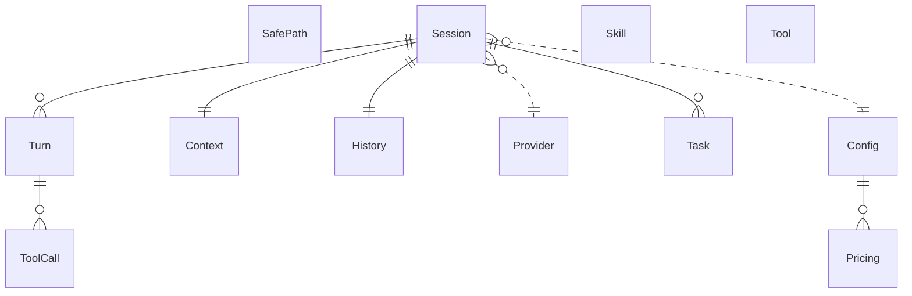

{/* Generated by `modelith render`. Do not edit by hand; edit the .modelith.yaml source and re-render. */}

# tell-me-go — Multi-Provider Reasoning Agent

A high-performance CLI assistant that unifies reasoning engines (Gemini, OpenAI, DeepSeek, Claude, Kimi) under a single interface. Models the core conversation loop, provider abstraction, tool execution, security boundaries, and cost auditing.

## Glossary

- **`Chatter`** — The conversation interface between the `Orchestrator` and the `Provider` gateway. Defines how prompts are sent, responses are streamed, and chat sessions are configured. Not an entity — it is a behavioral role with no persisted state, analogous to `Orchestrator` and `SecurityManager`.
- **`CoverageSummary`** — The tools-layer view of a coverage run, returned by the Go toolchain runner: the passed-test count, whether the package has no Go files, the coverage percentage, and the summary output. It is the consumer-facing projection of the infrastructure-internal coverage report, which stays infrastructure-internal by design (ADR-060). Not an entity — a value type with no relationships or lifecycle.
- **`Orchestrator`** — The top-level loop that drives a `Session`: receives a user prompt, delegates to the active `Provider`, dispatches `Tool` calls, and manages the `Turn` lifecycle.
- **`SecurityManager`** — The component that validates `Tool` requests against the `SafePath` registry and delegates to the `UserInteractor` when user confirmation is required.
- **`TellMeHome`** — The filesystem root directory for all tell-me-go state — `Config`s, local `Skill`s, `History`, `SafePath`s, and `Task`s. A `Session`'s `History` can be archived (`--new`) without affecting `SafePath`s or `Task`s because they are stored under `TellMeHome`, not inside the `Session`-scoped `History` file. The environment tools (Niffler, Dobby, etc.) manage this directory; tell-me-go treats it as the stable namespace for everything it persists.
- **`Thought`** — A provider-agnostic reasoning block emitted by an LLM — may be a text response, a tool-call request, or (for reasoning models) a chain-of-thought segment. Normalised from provider-specific wire formats.
- **`UserInteractor`** — The interface through which the `SecurityManager` prompts the user for confirmation (e.g. before a `Tool` accesses an unauthorized path). Implementations include the interactive TUI capturer and a no-op variant for automated workflows. Prompt suppression is controlled by `Config.bypassConfirmation`.

## Enums

### `APIFamily`

The wire-protocol family backing an LLM `Provider`. There are exactly three families — this is the compile-time-safe dispatch dimension (distinct from the user-facing `Provider.type` label string, which may include OpenAI-compatible providers like "deepseek" or "kimi").

| Value | Definition |
| --- | --- |
| `openai` | OpenAI-compatible API (covers openai, deepseek, kimi, and any future provider speaking the OpenAI protocol). |
| `anthropic` | Anthropic Messages API. |
| `gemini` | Google Gemini / Vertex AI API (covers google, gemini, vertex). |

### `LLMError`

Categories of `Provider` error that affect retry and failover behaviour. Distinguishing these lets the `Orchestrator` decide whether to retry the same `Provider`, switch to a fallback, or surface the error to the user.

| Value | Definition |
| --- | --- |
| `rate_limited` | The `Provider`'s quota has been exceeded; retry after backoff. |
| `context_overflow` | The accumulated prompt exceeds the model's context window. |
| `auth_failure` | The API key or credentials are invalid — no retry. |
| `server_error` | A transient 5xx from the `Provider`; may succeed on retry or failover. |
| `timeout` | The `Provider` did not respond within `Config.httpTimeout`. |

## Entities

### `Config`

The YAML configuration loaded at startup. Defines the active `Provider`, the full `Provider` registry, tool enablement flags, safety limits, and per-model `Pricing` overrides.

**Relationships**

- `Pricing` — 1:n — owned — Per-model cost rates from the built-in pricing table, overridable per model via the MODELS section.

**Attributes**

| Name | Type | Description |
| --- | --- | --- |
| `selectedProvider` | string | Key of the active `Provider` in the registry. |
| `maxToolTurns` | integer | Recursion limit on tool-execution iterations within a single `Turn` (YAML key `MAX_TURNS`). Bounds the Think → Act → Observe cycle; it does not cap the number of user `Turn`s in a `Session`. |
| `maxHistoryTurns` | integer | Turn-window pruning limit for `Context` assembly — at most this many `Turn`s are retained verbatim (0 = turn-based pruning disabled). Together with `maxHistoryTokens` this bounds the `Session`'s working history. |
| `maxHistoryTokens` | integer | Token budget for the retained `Context`; exceeding it triggers summarisation/pruning. |
| `contextWindow` | integer | _Derived:_ Effective token limit for the active model, resolved from `maxHistoryTokens`, per-model Models overrides, and `Pricing.contextWindow`. |
| `maxConcurrentTools` | integer | Maximum `ToolCall`s that may execute simultaneously within a single `Turn`. |
| `toolTimeout` | integer | Per-`ToolCall` execution timeout in seconds. |
| `httpTimeout` | integer | `Provider` request timeout in seconds. |
| `useSearch` | boolean | Enables Google Search grounding for Gemini `Provider`s (priced via `Pricing.searchQuery`). |
| `failoverOrder` | []string | Ordered `Provider` registry keys for the gateway's failover chain. |
| `useTUIPrompt` | boolean | Use the interactive TUI prompt (with suggestions) instead of the plain capturer. |
| `showThoughts` | boolean |  |
| `showTools` | boolean |  |
| `bypassConfirmation` | boolean | When true, all security prompts are skipped (used in CI/automation). |

**Invariants**

- **config-valid-provider** — `selectedProvider` must reference a key in the PROVIDERS registry.
- **bypass-suppresses-prompts** — When `Config.bypassConfirmation` is true, Confirm is never called — every authorization check is silently approved.

### `Context`

The in-flight prompt payload assembled by the `Orchestrator` before each `Turn`. Distinct from `History` (persisted) — `Context` is the runtime view: it holds the system prompt, injected `Skill` content, the recent `Turn` history (possibly summarised), and the current user prompt. Its token count is checked against `Pricing.contextWindow` before every `Turn`. In the code, `Context` is implemented as a package of cooperating types (`internal/agent/session/context/`) rather than a single struct. Each type has a single responsibility in the assembly pipeline: HistoryPruner removes old turns, TokenGatekeeper enforces the token budget, `pinningPolicy` protects pinned turns, `emptyTurnFilter` removes empty turns, `finalContextValidator` validates the final state, TransientMerger merges transient content, and Strategy orchestrates the pipeline. This decomposition is intentional — it keeps each concern testable in isolation.

**Attributes**

| Name | Type | Description |
| --- | --- | --- |
| `tokenCount` | integer | _Derived:_ Total tokens in the assembled payload. |
| `summarisedTurnCount` | integer | _Derived:_ Number of `Turn`s that have been summarised into this `Context`. |
| `pinnedTurnIndices` | []int | Indices of `Turn`s protected from summarisation. |

**Actions**

- `assemble` — actor `Orchestrator` — Build the payload: system prompt + injected `Skill`s + recent `Turn`s (summarised or verbatim) + current user prompt.
- `inject_skill` — actor `Orchestrator` — Insert a matched `Skill`'s content into the system prompt.
- `summarise` — actor `Orchestrator` — Compress older, non-pinned `Turn`s to keep token count within budget.

**Invariants**

- **context-within-budget** — `tokenCount` must not exceed the model's `Pricing.contextWindow`.
- **context-pinned-preserved** — Pinned `Turn`s are never summarised — they are always included verbatim.

### `History`

The persisted record of a `Session`'s `Turn`s, stored as an append-only JSON Lines file (`history.jsonl`) with an incremental patch system for metadata updates (e.g. pinning). Older `Turn`s that have been summarised are moved to a separate archive file (`history.archive.jsonl`) to keep the in-memory working set bounded. The archive supports O(1) lazy navigation via byte-offset indexing (`file.Seek`) — it is never loaded fully into memory. Patches are merged into clean base records during compaction (triggered by `save`, `rollback`, `edit`, and per-turn pipeline rewrites). Separate from the in-memory `Session` state.

**Attributes**

| Name | Type | Description |
| --- | --- | --- |
| `turns` | []Turn | Ordered list of persisted `Turn`s stored as individual JSONL lines. |
| `pinnedTurns` | []int | Indices of `Turn`s protected from summarisation/pruning, stored as `_patch` lines. |

**Actions**

- `append` — Append a `Turn` as a new JSONL line — O(1) disk operation.
- `save` — Atomic full rewrite of the active file, merging all outstanding patches.
- `archive` — Move summarised `Turn`s to `history.archive.jsonl` and remove them from the active file.
- `compact` — Merge outstanding `_patch` lines into clean base records.
- `rollback` — Remove the last N `Turn`s from the active file and persist.

**Invariants**

- **history-persisted-after-turn** — Every completed `Turn` is persisted before the next `Turn` begins.

### `Pricing`

The cost structure for a specific model variant. Maps a model identifier to per-million-token rates for cached hits, cache misses, and completion tokens. Owned by `Config`; `Turn` cost is computed by looking up the active `Provider`'s model in this table.

**Attributes**

| Name | Type | Description |
| --- | --- | --- |
| `modelName` | string | The model identifier this pricing applies to. |
| `contextWindow` | integer | Maximum token capacity for this model. |
| `hitRate` | decimal | USD per million cached input tokens. |
| `missRate` | decimal | USD per million uncached input tokens. |
| `compRate` | decimal | USD per million output (completion) tokens. |
| `thinkingBudget` | integer | Default thinking token budget for reasoning models (0 = disabled). Overridden by provider-level THINKING_BUDGET. |
| `searchQuery` | decimal | USD per search query (Google Search grounding). Applies to Gemini models with search enabled. |

**Invariants**

- **pricing-unique-model** — Each `modelName` appears at most once in the pricing table.

### `Provider`

An LLM backend reachable via a specific API. Encapsulates the type (gemini/openai/deepseek/anthropic/kimi), model name, endpoint URL, authentication, and provider-specific settings like thinking budget and the DeepSeek/Kimi thinking-mode toggle.

**Attributes**

| Name | Type | Description |
| --- | --- | --- |
| `name` | string | The registry key identifying this `Provider` (e.g. "vertex-flash", "deepseek-pro"). Note: In Go, this is the map key in `Config.Providers`, not a field on the `LLMProvider` struct. It is listed here because it is the `Provider`'s primary identity in the domain. |
| `type` | string | The user-facing label identifying this `Provider` (e.g. "vertex-flash", "deepseek-pro", "kimi"). This is a free-form string, not an enum — multiple labels map to the same `APIFamily`. The `family` attribute (derived) resolves this label to a wire-protocol family. |
| `family` | APIFamily | _Derived:_ Resolved from `type` via LLMProvider.Family() — "openai"/"deepseek"/"kimi" → openai, "anthropic" → anthropic, "google"/"gemini"/"" → gemini. |
| `model` | string | The model identifier sent on the wire. |
| `url` | string | Base API endpoint. |
| `maxTokens` | integer |  |
| `thinkingBudget` | integer | Max thinking tokens for reasoning models (0 = disabled). |
| `thinkingLevel` | string | Provider-specific reasoning effort (e.g. "HIGH"). |
| `thinkingEnabled` | boolean | Tri-state DeepSeek/Kimi thinking-mode toggle: nil = omit the field from the wire (preserve the provider default); true = thinking enabled; false = disabled. Only emitted for providers with the thinking-toggle capability. Distinct from `thinkingBudget` (token budget) and `thinkingLevel` (reasoning effort). |
| `userID` | string | DeepSeek `user_id` for content safety, KVCache, and scheduling isolation. Emitted only when non-empty for providers with the thinking-toggle capability. |
| `lastError` | LLMError | The most recent error returned by this `Provider` during the current `Session`, if any. Used by the `Orchestrator` to decide retry vs. failover. Note: Runtime-only — not stored on the `LLMProvider` struct. Tracked by the `Orchestrator`'s retry/failover logic. Resets on restart. |

**Invariants**

- **provider-unique-name** — Each `Provider` in the registry has a unique name.

### `SafePath`

A directory or file boundary authorized for `Tool` operations. Before a `Tool` reads or writes outside allowed boundaries, the `SecurityManager` prompts the user via the `UserInteractor` for confirmation. Once authorized, the path persists across `Session`s.

**Attributes**

| Name | Type | Description |
| --- | --- | --- |
| `path` | string | The absolute or relative path. |
| `mode` | string | Either "read" (read-only) or "readwrite" (full access). |
| `authorizedAt` | timestamp |  |

**Invariants**

- **safepath-absolute** — Paths are stored in canonical absolute form.

### `Session`

A long-running conversation context identified by a unique ID. Owns a sequence of `Turn`s, a `History` for persistence, and the active `Config`. Managed by the `Orchestrator`.

**Relationships**

- `Turn` — 1:n — owned
- `Config` — n:1 — referenced — The `Config` active when the `Session` was created.
- `Provider` — n:1 — referenced — The selected `Provider` for this `Session` (from `Config.PROVIDERS`).
- `History` — 1:1 — owned — Persisted record of this `Session`'s `Turn`s.
- `Context` — 1:1 — owned — The in-flight prompt payload assembled before each `Turn`.
- `Task` — 1:n — owned — User-facing to-do items persisted alongside `History`.

**Attributes**

| Name | Type | Description |
| --- | --- | --- |
| `id` | string | UUID assigned at creation. |
| `createdAt` | timestamp |  |
| `turnCount` | integer | _Derived:_ Number of `Turn`s in this `Session`. |
| `totalCost` | decimal | _Derived:_ Sum of all `Turn` costs in USD. |

**Actions**

- `start` — actor `Orchestrator` — Create a new `Session` with the resolved `Config` and `Provider`.
- `archive` — actor `Orchestrator` — Archive the `Session`'s `History` and start a fresh one.
- `undo` — actor `Orchestrator` — Remove the last N `Turn`s and persist the change.

**Invariants**

- **session-max-turns** — The `Session`'s working history is bounded: `Context` retains at most `Config.maxHistoryTurns` `Turn`s (0 = unlimited) within `Config.maxHistoryTokens` tokens.

### `Skill`

A block of guidance injected into the system prompt when the task is relevant. `Skill`s are stored as SKILL.md files (YAML frontmatter + Markdown body) following the skills.sh format. They come from two sources: local `docs/skills/` (curated by the Dobby template, e.g. golang-patterns, golang-testing) and the skills.sh ecosystem `.skills/` (installed on demand via `install_skill`). Injection is triggered by keyword matching against the user prompt via the skill selector, and injected into `Context` by the skill injector.

**Attributes**

| Name | Type | Description |
| --- | --- | --- |
| `name` | string | Unique skill identifier from YAML frontmatter. |
| `description` | string | Human-readable summary from YAML frontmatter; used in `list_skills` output. |
| `content` | string | The Markdown body injected into the context. |
| `tokenCount` | integer | _Derived:_ Heuristic: len(content) / 4. |
| `source` | string | "local" for docs/skills/, "skills.sh" for .skills/. Used by remove_skill to gate deletion. |

**Invariants**

- **skill-unique-name** — Each `Skill` has a unique name.
- **skill-remove-source-gate** — Only `Skill`s with `source: skills.sh` can be removed by `remove_skill`; local skills are protected.

### `Task`

A unit of work tracked by the system for the user. `Task`s form a simple to-do list: each has a description, a status (pending or completed), and a creation timestamp. Owned by `Session` — tasks are persisted alongside the session's `History`.

**Attributes**

| Name | Type | Description |
| --- | --- | --- |
| `id` | integer | Monotonically increasing unique identifier. |
| `content` | string | Human-readable description of the task. |
| `status` | string | Current state: "pending" or "completed". |
| `createdAt` | timestamp |  |

**Actions**

- `add` — actor `Orchestrator` — Create a new `Task` with status "pending".
- `update` — actor `Orchestrator` — Modify the content or status of an existing `Task`.
- `delete` — actor `Orchestrator` — Remove a `Task` from the list.
- `list` — actor `Orchestrator` — Retrieve `Task`s, optionally filtered by status.

**Invariants**

- **task-non-empty-content** — A `Task`'s `content` must not be empty.

### `Tool`

A capability exposed to the LLM for agentic execution. `Tool`s are registered at startup and carry a JSON Schema describing their parameters. Categories include workspace (files, git), analysis (AST, architecture), integrations (Jira, ADO, Teams), and system (shell, testing). Analysis tools return a `CoverageSummary` of a coverage run.

**Attributes**

| Name | Type | Description |
| --- | --- | --- |
| `name` | string | Unique tool identifier (e.g. "execute_command"). |
| `description` | string | Human-readable purpose; injected into the system prompt. |
| `schema` | object | JSON Schema for the tool's parameters. |
| `requiresConsent` | boolean | Whether the user must approve this `Tool`'s invocation before it executes. The `Orchestrator` displays a consent prompt before calling the handler. Distinct from `SafePath` validation which is performed by the `SecurityManager` on path-accessing tools. |

**Invariants**

- **tool-unique-name** — Each `Tool` has a unique name.

### `ToolCall`

A single invocation of a `Tool` requested by the LLM during a `Turn`. Carries the tool name, arguments, result, and timing. `ToolCall`s may execute concurrently (up to `Config.maxConcurrentTools`).

**Attributes**

| Name | Type | Description |
| --- | --- | --- |
| `toolName` | string |  |
| `arguments` | object |  |
| `result` | string |  |
| `duration` | duration |  |
| `status` | string | success, error, or timeout. |

**Invariants**

- **tool-timeout** — Execution duration must not exceed `Config.toolTimeout` seconds.
- **tool-max-concurrent** — At most `Config.maxConcurrentTools` `ToolCall`s may execute simultaneously within a single `Turn`.

### `Turn`

One atomic exchange: a user prompt, zero or more assistant `Thought`s (possibly interleaved with `Tool` executions), and a final response. Every `Turn` belongs to exactly one `Session`. In the code, `Turn` also serves as the `Orchestrator`'s unit of execution — it carries runtime dependencies (gateway, executor, event bus) needed to process the turn. This hybrid nature is intentional: separating "what a Turn is" from "how a Turn runs" would add indirection without clear benefit.
`Turn` is both a domain entity and an application-layer execution context. The domain fields (`prompt`, `thoughts`, `tokenCount`, `cost`, `responseHash`) are declared below; runtime fields (gateway, executor, registry, token counter, event bus, cost tracker, context manager, clock, logger) are carried on the struct at `internal/agent/orchestrator/engine.go`.

**Relationships**

- `ToolCall` — 1:n — owned — `Tool` invocations requested during this `Turn`.

**Attributes**

| Name | Type | Description |
| --- | --- | --- |
| `prompt` | string | The user's input text. |
| `thoughts` | []Thought | The sequence of provider-agnostic reasoning blocks. |
| `tokenCount` | integer | _Derived:_ Total tokens consumed (input + output + thinking). |
| `cost` | decimal | _Derived:_ USD cost computed from token counts and `Provider` pricing. |
| `responseHash` | string | SHA-256 of the final response — used for hallucination loop detection. |

**Invariants**

- **turn-belongs-to-one-session** — A `Turn` belongs to exactly one `Session`.
- **turn-max-tool-iterations** — Tool-execution iterations within a single `Turn` must not exceed `Config.maxToolTurns`.

## Relationships

## Invariants

- **deterministic-cost-audit** — Every `Turn`'s cost is computed from token counts and the `Provider`'s pricing model before the next `Turn` begins, and accumulated on the `Session`.

## Scenarios

### Basic question-answer turn

A user asks a question that requires no `Tool`s. The `Orchestrator` assembles the `Context`, sends it to the selected `Provider`, receives a `Thought` (text), and renders the response.

**Actors:** Orchestrator, Chatter, Context, Provider, Session, Task

**Steps**

1. User submits a prompt via CLI.
2. `Orchestrator` creates a `Turn` in the current `Session`.
3. `Orchestrator` assembles the `Context`: system prompt + recent `Turn`s + user prompt.
4. `Orchestrator` sends the `Context` to the `Provider` via `Chatter`.
5. `Provider` returns a text `Thought` via `Chatter`.
6. `Orchestrator` renders the response and persists the `Turn` to `History`.
7. Cost and token metrics are updated on the `Session`.
8. Any pending `Task`s are tracked and can be listed by the user.

**Invariants touched**

- **session-max-turns** — The `Session`'s working history is bounded: `Context` retains at most `Config.maxHistoryTurns` `Turn`s (0 = unlimited) within `Config.maxHistoryTokens` tokens.
- **history-persisted-after-turn** — Every completed `Turn` is persisted before the next `Turn` begins.
- **context-within-budget** — `tokenCount` must not exceed the model's `Pricing.contextWindow`.
- **turn-belongs-to-one-session** — A `Turn` belongs to exactly one `Session`.

### Cost auditing per turn

After every `Turn` completes, the `Orchestrator` computes its USD cost using the token counts and the active `Provider`'s `Pricing` rates, then accumulates it on the `Session`. This ensures deterministic, real-time budget visibility — no hidden expenses.

**Actors:** Orchestrator, Turn, Pricing, Session

**Steps**

1. A `Turn` completes with known token counts (input, output, thinking).
2. `Orchestrator` looks up the active `Provider`'s model in `Pricing`.
3. Cost is computed: (input × rate) + (output × rate) + (thinking × rate).
4. The `Turn`'s `cost` attribute is set.
5. The `Session`'s `totalCost` is updated to include this `Turn`.

**Invariants touched**

- **deterministic-cost-audit** — Every `Turn`'s cost is computed from token counts and the `Provider`'s pricing model before the next `Turn` begins, and accumulated on the `Session`.
- **pricing-unique-model** — Each `modelName` appears at most once in the pricing table.

### Skill injection into context

When the user's prompt matches a `Skill`'s keywords, the `Orchestrator` injects that `Skill`'s guidance into the `Context` system prompt. `Skill`s are loaded from two sources: local `docs/skills/` (always available) and `.skills/` (installed on demand from skills.sh). Both are merged by a composite repository before keyword matching.

**Actors:** Orchestrator, Skill, Context, Provider, Session

**Steps**

1. User submits a prompt containing keywords that match a `Skill`.
2. `Orchestrator` scans all registered `Skill`s from both local and skills.sh sources.
3. The matched `Skill`'s content is injected into the `Context` system prompt.
4. `Provider` receives the augmented `Context` and responds accordingly.
5. The `Turn` is persisted as normal.
6. If a skill from the skills.sh ecosystem was installed mid-session, it becomes available on the next `Turn`.

**Invariants touched**

- **skill-unique-name** — Each `Skill` has a unique name.
- **context-within-budget** — `tokenCount` must not exceed the model's `Pricing.contextWindow`.
- **skill-remove-source-gate** — Only `Skill`s with `source: skills.sh` can be removed by `remove_skill`; local skills are protected.

### Tool-augmented turn

The LLM requests a `Tool` call. The `Orchestrator` dispatches it, feeds the result back to the `Provider`, and continues until the LLM emits a final text response.

**Actors:** Orchestrator, Provider, Tool, ToolCall, Session

**Steps**

1. `Provider` returns a `Thought` requesting a `Tool` execution.
2. `Orchestrator` validates the `Tool` name and arguments.
3. If the `Tool` requires consent, the `Orchestrator` prompts the user for approval.
4. If the `Tool` accesses paths, the `SecurityManager` validates them against the `SafePath` registry.
5. `Orchestrator` executes the `Tool` (possibly concurrently with others), bounded by `Config.maxToolTurns` iterations.
6. The `Tool` result is fed back to the `Provider`.
7. The cycle repeats until `Provider` emits a final text `Thought`.
8. The `Turn` (with all `ToolCall`s) is persisted to `History`.

**Invariants touched**

- **tool-timeout** — Execution duration must not exceed `Config.toolTimeout` seconds.
- **tool-unique-name** — Each `Tool` has a unique name.
- **turn-max-tool-iterations** — Tool-execution iterations within a single `Turn` must not exceed `Config.maxToolTurns`.

### Hallucination loop detection

The `Orchestrator` detects when the LLM is stuck in a loop via two mechanisms: (1) response hashing — SHA-256 of the sanitized response is compared against a sliding window of recent hashes; any duplicate triggers the break, and (2) tool-call counting — identical `FunctionCall` name+arguments pairs that repeat beyond the threshold are detected immediately. When either triggers, synthetic feedback is injected to break the cycle.

**Actors:** Orchestrator, Session, Turn

**Steps**

1. `Orchestrator` computes SHA-256 of the sanitized final response (excluding mutable fields like ID) for a `Turn`.
2. The hash is compared against a sliding window of recent response hashes. Any duplicate in the window triggers detection.
3. In parallel, identical function-call name+arguments pairs are counted per-`Turn`. Repeating a tool call beyond the threshold triggers detection immediately.
4. When a loop is detected, the `Orchestrator` publishes a warning, persists the repeating response, injects synthetic corrective feedback, and signals the `Turn` to complete.

**Invariants touched**

- **session-max-turns** — The `Session`'s working history is bounded: `Context` retains at most `Config.maxHistoryTurns` `Turn`s (0 = unlimited) within `Config.maxHistoryTokens` tokens.

### Context overflow and summarisation

When the assembled `Context` approaches the model's token budget, the `Orchestrator` summarises older `Turn`s while preserving pinned ones verbatim — keeping the `Context` within the `Pricing.contextWindow` limit without losing critical information.

**Actors:** Orchestrator, Context, History, Session

**Steps**

1. `Orchestrator` assembles the `Context` and checks `tokenCount`.
2. `tokenCount` exceeds the model's `Pricing.contextWindow`.
3. `Orchestrator` identifies the oldest non-pinned `Turn`s.
4. Those `Turn`s are summarised; pinned `Turn`s are preserved verbatim.
5. The summarised content replaces the original `Turn`s in `Context`.
6. `Context.tokenCount` is recomputed and now fits within budget.

**Invariants touched**

- **context-within-budget** — `tokenCount` must not exceed the model's `Pricing.contextWindow`.
- **context-pinned-preserved** — Pinned `Turn`s are never summarised — they are always included verbatim.
- **history-persisted-after-turn** — Every completed `Turn` is persisted before the next `Turn` begins.

### Provider error classification and failover

When the selected `Provider` returns an error, the `Orchestrator` classifies it using the `LLMError` taxonomy: rate limits and server errors may retry or fail over; auth failures and context overflows are terminal for that `Provider` and handled differently.

**Actors:** Orchestrator, Provider, Config, Pricing

**Steps**

1. `Provider` returns an error response.
2. `Orchestrator` classifies the error: `rate_limited`, `server_error`, `timeout`, `auth_failure`, or `context_overflow`.
3. For `rate_limited`: `Orchestrator` applies backoff and retries the same `Provider`.
4. For `server_error` or `timeout`: the `Orchestrator` retries the same `Provider` with backoff. Provider-level failover to an alternate is handled by the gateway layer on subsequent requests, not by the per-turn recovery step.
5. For `auth_failure`: `Orchestrator` surfaces the error immediately — no retry.
6. For `context_overflow`: `Orchestrator` triggers `Context` summarisation and retries.
7. The user is informed of the resolution path taken.

**Invariants touched**

- **config-valid-provider** — `selectedProvider` must reference a key in the PROVIDERS registry.
- **context-within-budget** — `tokenCount` must not exceed the model's `Pricing.contextWindow`.

### Session undo and retry

The user undoes the last N `Turn`s via the `--back-n` CLI flag. If a `--prompt` is also provided, a fresh chat session begins after the rollback, effectively retrying with the rolled-back history.

**Actors:** Orchestrator, Session, History

**Steps**

1. User invokes undo via the `--back-n` CLI flag.
2. `Orchestrator` rolls back the `History` manager, removing the last N `Turn`s from persistent storage.
3. `History` is synced to disk to reflect the rollback.
4. If a `--prompt` is also provided on the same invocation, a fresh `Session` begins after rollback, sending the new prompt to the `Provider` with the rolled-back history as context.

**Invariants touched**

- **history-persisted-after-turn** — Every completed `Turn` is persisted before the next `Turn` begins.

### Path authorization

A `Tool` attempts to access a path outside the project boundary. The `SecurityManager` prompts the user for confirmation before allowing access.

**Actors:** SecurityManager, UserInteractor, SafePath, Tool

**Steps**

1. `Tool` requests access to a path.
2. `SecurityManager` checks if the path is within any registered `SafePath`.
3. If not, and `bypassConfirmation` is false, the `UserInteractor` prompts the user.
4. If the user approves, the path is registered as a `SafePath` and the `Tool` proceeds.
5. If the user denies, the `Tool` returns an error.
6. If `bypassConfirmation` is true, the check is silently skipped.

**Invariants touched**

- **safepath-absolute** — Paths are stored in canonical absolute form.
- **bypass-suppresses-prompts** — When `Config.bypassConfirmation` is true, Confirm is never called — every authorization check is silently approved.

### Concurrent tool execution

The LLM requests multiple independent `Tool` calls in a single response. The `Orchestrator` dispatches them concurrently (up to `Config.maxConcurrentTools`), collects results as they complete, and feeds the aggregated results back to the `Provider` in one batch.

**Actors:** Orchestrator, Provider, Tool, ToolCall, Session

**Steps**

1. `Provider` returns a `Thought` requesting three independent `Tool` executions.
2. `Orchestrator` validates each `Tool` name and arguments.
3. `Orchestrator` dispatches all three `ToolCall`s concurrently, respecting `Config.maxConcurrentTools`.
4. Each `ToolCall` executes independently; one takes longer but stays within `Config.toolTimeout`.
5. Results are collected and fed back to the `Provider` in a single response.
6. `Provider` integrates the results and emits a final text `Thought`.
7. The `Turn` (with all `ToolCall`s, each carrying its own `duration` and `status`) is persisted to `History`.

**Invariants touched**

- **tool-timeout** — Execution duration must not exceed `Config.toolTimeout` seconds.
- **tool-unique-name** — Each `Tool` has a unique name.
- **tool-max-concurrent** — At most `Config.maxConcurrentTools` `ToolCall`s may execute simultaneously within a single `Turn`.
- **turn-max-tool-iterations** — Tool-execution iterations within a single `Turn` must not exceed `Config.maxToolTurns`.

### Session crash recovery

A `Turn` is in progress when the process crashes. On restart, the `Orchestrator` recovers the `Session` from the append-only JSONL `History`. Because `History` appends each `Turn` atomically as a single line only after the `Turn` completes, the interrupted `Turn` was never written — all previously committed `Turn`s are intact. The `Session` resumes cleanly without data loss.

**Actors:** Orchestrator, History, Session, Turn

**Steps**

1. A `Session` has three completed `Turn`s persisted to `History`.
2. The fourth `Turn` begins — the `Provider` is called but the process crashes before the response arrives.
3. On restart, the `Orchestrator` loads the `History` file from disk.
4. The `History` contains exactly three `Turn`s — the interrupted fourth was never appended.
5. The `Orchestrator` reconstructs the `Session` from those three `Turn`s.
6. The user is informed that the previous session was recovered.
7. The next user prompt begins a fresh fourth `Turn`.

**Invariants touched**

- **history-persisted-after-turn** — Every completed `Turn` is persisted before the next `Turn` begins.
- **turn-belongs-to-one-session** — A `Turn` belongs to exactly one `Session`.

### Turn pinning and protection

The user explicitly pins specific `Turn`s to protect them from summarisation. Later, when the `Context` overflows the model's token budget, the `Orchestrator` summarises older unpinned `Turn`s while preserving the pinned `Turn`s verbatim — ensuring critical decisions and findings survive context compression intact.

**Actors:** Orchestrator, Context, History, Session, Turn

**Steps**

1. A long `Session` accumulates 20 `Turn`s; the user pins `Turn` 5 (an architectural decision) and `Turn` 15 (a key test result) via `manage_history`.
2. The pinned indices are persisted as `_patch` lines in `History`.
3. On `Turn` 21, the `Orchestrator` assembles the `Context` and finds `tokenCount` exceeds `Pricing.contextWindow`.
4. The `Orchestrator` identifies the oldest non-pinned `Turn`s for summarisation.
5. `Turn`s 5 and 15 are skipped — their content remains verbatim in `Context`.
6. Older unpinned `Turn`s are compressed into summarised blocks.
7. `Context.tokenCount` is recomputed and now fits within budget.
8. The `Provider` receives the compressed `Context` where the pinned `Turn`s are still exact.

**Invariants touched**

- **context-within-budget** — `tokenCount` must not exceed the model's `Pricing.contextWindow`.
- **context-pinned-preserved** — Pinned `Turn`s are never summarised — they are always included verbatim.
- **history-persisted-after-turn** — Every completed `Turn` is persisted before the next `Turn` begins.

### Fresh session with global state preservation

The user starts a new `Session` via `--new`. The `Orchestrator` archives the old `Session`'s `History` (all `Turn`s are moved to the archive file) but preserves global state: `SafePath` registrations and `Task`s survive across sessions because they are stored under `TellMeHome`, not inside the `Session`-scoped `History` file. The new `Session` begins with a clean conversation but retains the user's authorized paths and to-do list.

**Actors:** Orchestrator, Session, History, SafePath, Task

**Steps**

1. User has an active `Session` with 15 `Turn`s, 3 registered `SafePath`s, and 2 pending `Task`s.
2. User invokes `tell-me-go --new "Start fresh"`.
3. The `Orchestrator` archives the old `Session`: its `History` is moved to the archive file.
4. Global state (`SafePath`s and `Task`s) is preserved — they outlive the old `Session`.
5. A new `Session` is created with a fresh conversation context.
6. The new `Session`'s `History` starts with 0 `Turn`s.
7. The 3 `SafePath`s are still registered and active — `Tool`s respect them immediately.
8. The 2 `Task`s are still pending and visible to the user.
9. The user prompt is sent as the first `Turn` of the new `Session`.

**Invariants touched**

- **safepath-absolute** — Paths are stored in canonical absolute form.
- **task-non-empty-content** — A `Task`'s `content` must not be empty.
- **history-persisted-after-turn** — Every completed `Turn` is persisted before the next `Turn` begins.

### Config hot-reload mid-session

The user edits the YAML `Config` file (e.g. changing `MAX_TURNS`, `MAX_HISTORY_TURNS`, or the context window) while a `Turn` is in progress. The `Orchestrator` detects the file change at the next phase transition (between inference and tool execution), re-reads the changed limits, and atomically applies them — without restarting the `Session`. Switching the active `Provider` requires a new session; the hot-reload path refreshes only operational limits, not provider identity.

**Actors:** Orchestrator, Config, Context, Provider, Session

**Steps**

1. A `Session` is mid-`Turn`: the `Provider` has returned a response with tool calls.
2. While the LLM was responding, the user edits `assistant.yaml` to raise `MAX_TURNS` (the `Config.maxToolTurns` limit) from 20 to 50.
3. The `Orchestrator`'s `configRefreshHook` fires on the `Inference → Execution` phase transition.
4. The config watcher re-reads the file and extracts updated limits (`maxHistoryTokens`, `maxToolTurns`, `maxHistoryTurns`, `contextWindow`).
5. New limits are atomically applied: `Context` token budget, max tool turns, and concurrency are updated.
6. Tool execution proceeds with the updated limits.
7. `SELECTED_PROVIDER` is not refreshed — switching providers requires a new `Session`.

**Invariants touched**

- **context-within-budget** — `tokenCount` must not exceed the model's `Pricing.contextWindow`.
- **turn-max-tool-iterations** — Tool-execution iterations within a single `Turn` must not exceed `Config.maxToolTurns`.

### Retry last turn

The user invokes `--retry` after an unsatisfactory response. Before the session loop begins, the `ChatService` locates the last user message in `History`, prompts the user for confirmation, rolls back exactly one `Turn`, and rewrites the command parameters so the `Orchestrator` resends the original prompt as a fresh `Turn`. The user does not need to re-type or even know the original prompt — it is recovered automatically from `History`.

**Actors:** Orchestrator, Session, History, Turn

**Steps**

1. The user receives a model response they are unhappy with.
2. User invokes `tell-me-go --retry`.
3. Before the session loop starts, ChatService calls `History.GetLastUserMessage`, which scans backward to find the most recent user-role message.
4. The method returns both the original prompt text and the number of `Turn`s to roll back (typically 1 for a standard user→model pair).
5. The user is prompted: `Retry? [y/N]`. If declined, the operation aborts with no changes.
6. On confirmation, ChatService rewrites the command's prompt and BackN fields and the `Orchestrator` rolls back `History` by the computed number of `Turn`s.
7. `History` is synced to disk to reflect the rollback.
8. The `Orchestrator` begins a fresh `Session` loop with the recovered prompt.
9. The new `Turn` begins with the rolled-back `History` as context.

**Invariants touched**

- **history-persisted-after-turn** — Every completed `Turn` is persisted before the next `Turn` begins.
- **turn-belongs-to-one-session** — A `Turn` belongs to exactly one `Session`.

